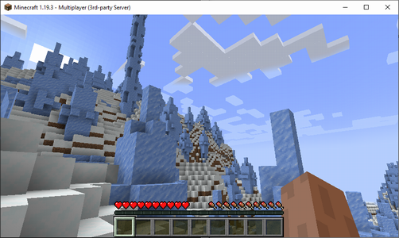

# remotekube


This is a helper tool for automatically deploying [remoteit-agent](https://hub.docker.com/r/remoteit/remoteit-agent) pods to your Kubenetes cluster so you can connect to your containerized applications in an isolated private network over the internet without accepting any inbound traffic.

## How it works
This tool runs as a pod on your Kubernetes cluster.
It automatically detects ClusterIP-type Service annotated with "remotekube/..." keys and deploys a remoteit-agent pod for each Service.
Each remoteit-agent pod is registered to your [Remote.it](https://app.remote.it/) account.
Remote.it service is also registered based on the annotations in a corresponding Kubernetes Service.
Once you remove an annotated Kubernetes Service from your cluster, corresponding remoteit-agent pod and Remote.it device are also automatically removed.


## Prerequisites
- Kubernetes cluster where you are allowed to deploy the following insanely addictive games
   - https://hub.docker.com/r/alexwhen/docker-2048
   - https://hub.docker.com/r/itzg/minecraft-server
- ACCESS KEY ID and SECRET ACCESS KEY in Remote.it account
   - https://app.remote.it/ > Account > Access Keys > CREATE ACCESS KEY

## How to enjoy
Deploy remotekube to your Kubernetes cluster
```bash
curl -sLO https://raw.githubusercontent.com/ryotayaguchi/remotekube/main/kubernetes/remotekube.yaml
sed -i -e 's/PUT_YOUR_KEY_ID_HERE/ABC**************789/' remotekube.yaml # Replace with your access key ID
sed -i -e 's/PUT_YOUR_SECRET_HERE/Ab1**************9yZ/' remotekube.yaml # Replace with your secret access key
kubectl apply -f remotekube.yaml
kubectl rollout status deployment/remotekube -n remotekube
```

Deploy games to your Kubernetes cluster
```bash
kubectl apply -f https://raw.githubusercontent.com/ryotayaguchi/remotekube/main/kubernetes/game2048.yaml
kubectl apply -f https://raw.githubusercontent.com/ryotayaguchi/remotekube/main/kubernetes/minecraft.yaml
```

You should be able to see new device(s) with name starting "remotekube-" in your Remote.it account within 10-20 seconds.


Once you create a new connection for a service "remotekube" of the new device in Remote.it console, you can get its endpoint hostname and port number.
It's time to enjoy games on your isolated Kubernetes cluster!

 

After you regret spending too much time enjoying the games, you may want to delete everything before someone notices it.
You can delete the deployed resources as below.

Delete the games
```bash
kubectl delete -f https://raw.githubusercontent.com/ryotayaguchi/remotekube/main/kubernetes/game2048.yaml
kubectl delete -f https://raw.githubusercontent.com/ryotayaguchi/remotekube/main/kubernetes/minecraft.yaml
```

You can delete remotekube after waiting for 30-40 seconds until the devices are removed from your Remote.it account by remotekube.

```bash
kubectl delete -f remotekube.yaml
```

